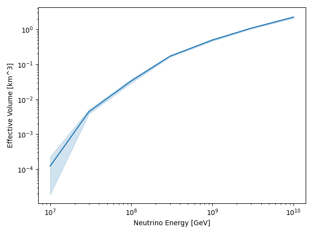

.. _example-combine-sim:

Combine Effective Volume Simulations
====================================

In this example we will illustrate a set of files with effective volume data can be combined to produce a high-statistics effective volume curve. This code can be found in the `combining_simulations.py <https://github.com/bhokansonfasig/pyrex/blob/master/examples/combining_simulations.py>`_ script in the examples directory. A typical set of arguments for the script might look like the following:

.. code-block:: shell

    python combining_simulations.py /path/to/output/directory/ ara02_ENERGY_INDEX.h5

.. warning:: This script is intended to be run on the files output by the script in the previous example, :ref:`example-distributed-sim`.

.. literalinclude:: code/combining_simulations.py
    :language: python

