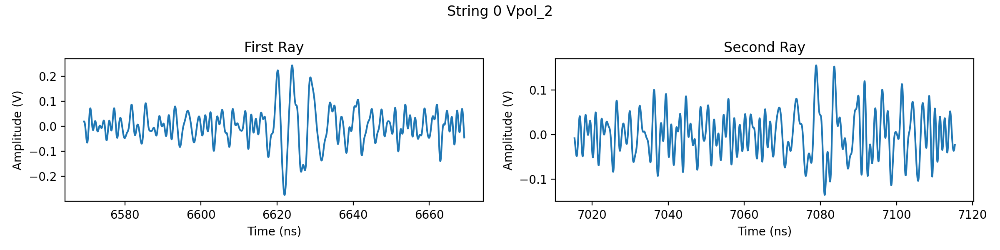
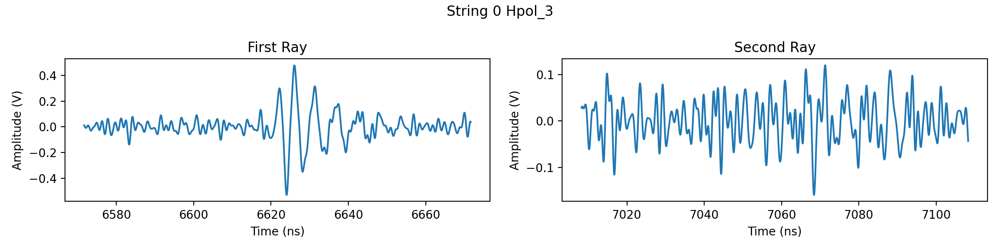
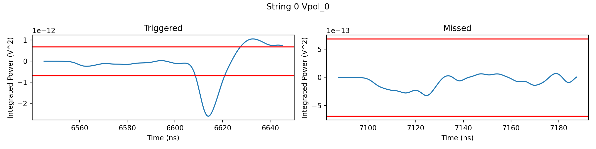
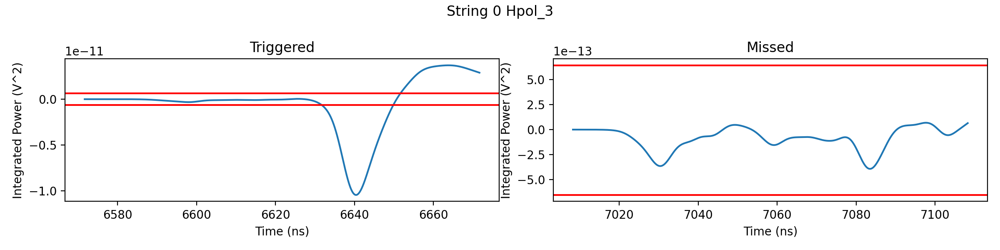
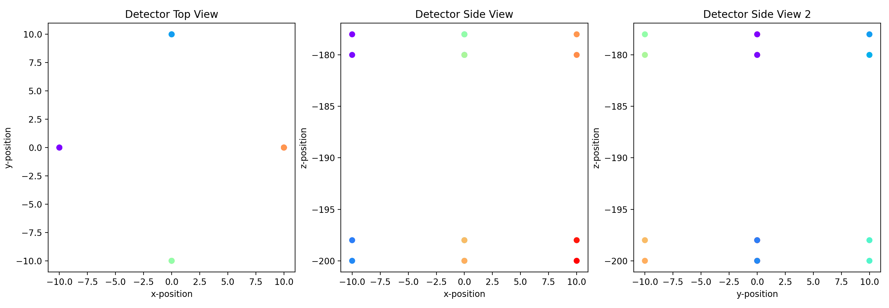

Examine a Single Event
======================

In this example we will generate a single event with a given vertex, direction, and energy, and then we'll examine the event by plotting the waveforms. This is typically useful for auditing events from a larger simulation. This code can be run from the `examine_event.py <https://github.com/bhokansonfasig/pyrex/blob/master/examples/examine_event.py>`_ script in the examples directory.

.. literalinclude:: code/examine_event.py
    :language: python

.. image:: ../_static/example_outputs/examine_event_1.png
.. image:: ../_static/example_outputs/examine_event_2.png
.. image:: ../_static/example_outputs/examine_event_3.png

.. image:: ../_static/example_outputs/examine_event_7.png
.. image:: ../_static/example_outputs/examine_event_8.png

