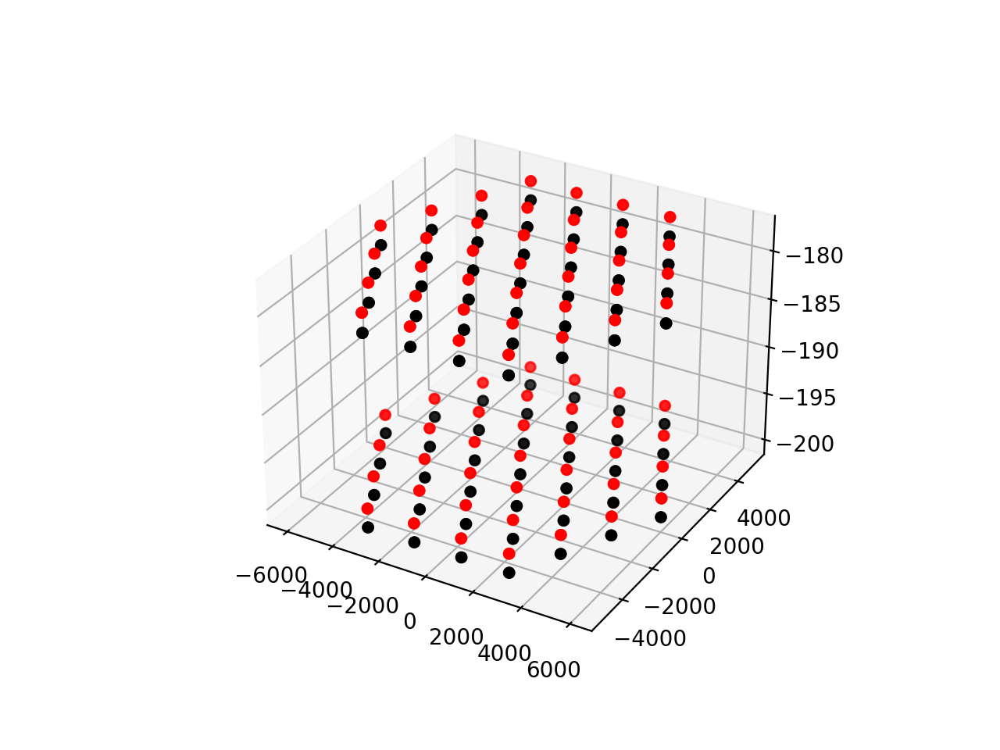
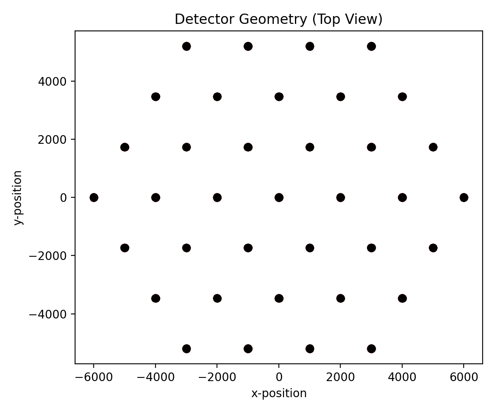

Plot Detector Geometry
======================

In this example we will make a few simple plots of the geometry of a detector object, handy for presentations or for visualizing your work. This code can be run from the `plot_detector.py <https://github.com/bhokansonfasig/pyrex/blob/master/examples/plot_detector.py>`_ script in the examples directory.

.. literalinclude:: code/plot_detector.py
    :language: python

.. image:: ../_static/example_outputs/plot_detector_3.png
