How to Use PyREx
****************

This section describes in detail how to use a majority of the functions and classes included in the base PyREx package, along with short example code segments. The code in each section is designed to run sequentially, and the code examples all assume these imports::

    import numpy as np
    import matplotlib.pyplot as plt
    import scipy.fftpack
    import scipy.signal
    import pyrex

All of the following examples can also be found (and easily run) in the Code Examples python notebook found in the examples directory.

.. currentmodule:: pyrex

Working with Signal Objects
===========================

The base :class:`Signal` class consists of an array of times and an array of corresponding signal values, and is instantiated with these two arrays. The :attr:`times` array is assumed to be in units of seconds, but there are no general units for the :attr:`values` array. It is worth noting that the Signal object stores shallow copies of the passed arrays, so changing the original arrays will not affect the :class:`Signal` object. ::

    time_array = np.linspace(0, 10)
    value_array = np.sin(time_array)
    my_signal = pyrex.Signal(times=time_array, values=value_array)

Plotting the :class:`Signal` object is as simple as plotting the times vs the values::

    plt.plot(my_signal.times, my_signal.values)
    plt.show()

.. image:: _static/example_outputs/signal_1.png

While there are no specified units for :attr:`Signal.values`, there is the option to specify the :attr:`value_type` of the :attr:`values`. This is done using the :attr:`Signal.Type` enum. By default, a :class:`Signal` object has ``value_type=Type.unknown``. However, if the signal represents a voltage, electric field, or power; :attr:`value_type` can be set to :attr:`Signal.Type.voltage`, :attr:`Signal.Type.field`, or :attr:`Signal.Type.power` respectively::

    my_voltage_signal = pyrex.Signal(times=time_array, values=value_array,
                                     value_type=pyrex.Signal.Type.voltage)

:class:`Signal` objects can be added as long as they have the same time array and :attr:`value_type`. :class:`Signal` objects also support the python :func:`sum` function::

    time_array = np.linspace(0, 10)
    values1 = np.sin(time_array)
    values2 = np.cos(time_array)
    signal1 = pyrex.Signal(time_array, values1)
    plt.plot(signal1.times, signal1.values, label="signal1 = sin(t)")
    signal2 = pyrex.Signal(time_array, values2)
    plt.plot(signal2.times, signal2.values, label="signal2 = cos(t)")
    signal3 = signal1 + signal2
    plt.plot(signal3.times, signal3.values, label="signal3 = sin(t)+cos(t)")
    all_signals = [signal1, signal2, signal3]
    signal4 = sum(all_signals)
    plt.plot(signal4.times, signal4.values, label="signal4 = 2*(sin(t)+cos(t))")
    plt.legend()
    plt.show()

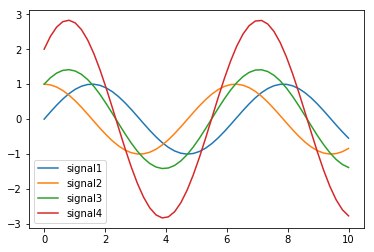

The :class:`Signal` class provides many convenience attributes for dealing with signals::

    my_signal.dt == my_signal.times[1] - my_signal.times[0]
    my_signal.spectrum == scipy.fftpack.fft(my_signal.values)
    my_signal.frequencies == scipy.fftpack.fftfreq(n=len(my_signal.values),
                                                   d=my_signal.dt)
    my_signal.envelope == np.abs(scipy.signal.hilbert(my_signal.values))

The :class:`Signal` class also provides functions for manipulating the signal. The :meth:`Signal.resample` method will resample the times and values arrays to the given number of points (with the same endpoints)::

    my_signal.resample(1001)
    len(my_signal.times) == len(my_signal.values) == 1001
    my_signal.times[0] == 0
    my_signal.times[-1] == 10
    plt.plot(my_signal.times, my_signal.values)
    plt.show()

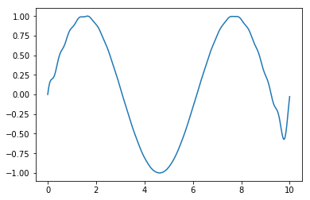

The :meth:`Signal.with_times` method will interpolate/extrapolate the signal's values onto a new times array::

    new_times = np.linspace(-5, 15)
    new_signal = my_signal.with_times(new_times)
    plt.plot(new_signal.times, new_signal.values, label="new signal")
    plt.plot(my_signal.times, my_signal.values, label="original signal")
    plt.legend()
    plt.show()

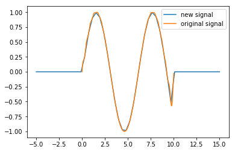

The :meth:`Signal.filter_frequencies` method will apply a frequency-domain filter to the values array based on the passed frequency response function. In cases where the filter is designed for only positive freqeuncies (as below) the filtered frequency may exhibit strange behavior, including potentially having an imaginary part. To resolve that issue, pass ``force_real=True`` to the :meth:`Signal.filter_frequencies` method which will extrapolate the given filter to negative frequencies and ensure a real-valued filtered signal. ::

    def lowpass_filter(frequency):
        if frequency < 1:
            return 1
        else:
            return 0

    time_array = np.linspace(0, 10, 1001)
    value_array = np.sin(0.1*2*np.pi*time_array) + np.sin(2*2*np.pi*time_array)
    my_signal = pyrex.Signal(times=time_array, values=value_array)

    plt.plot(my_signal.times, my_signal.values, label="original")
    my_signal.filter_frequencies(lowpass_filter, force_real=True)
    plt.plot(my_signal.times, my_signal.values, label="filtered")
    plt.legend()
    plt.show()

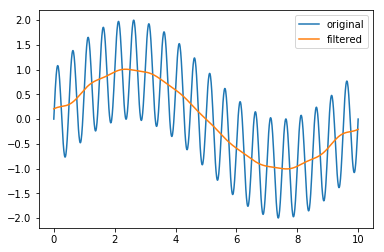

A number of classes which inherit from the :class:`Signal` class are included in PyREx: :class:`EmptySignal`, :class:`FunctionSignal`, :class:`AskaryanSignal`, and :class:`ThermalNoise`. :class:`EmptySignal` is simply a signal whose values are all zero::

    time_array = np.linspace(0,10)
    empty = pyrex.EmptySignal(times=time_array)
    plt.plot(empty.times, empty.values)
    plt.show()

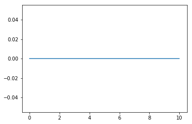

:class:`FunctionSignal` takes a function of time and creates a signal based on that function::

    time_array = np.linspace(0, 10, num=101)
    def square_wave(time):
        if int(time)%2==0:
            return 1
        else:
            return -1
    square_signal = pyrex.FunctionSignal(times=time_array, function=square_wave)
    plt.plot(square_signal.times, square_signal.values)
    plt.show()

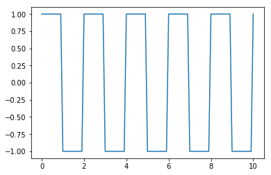

Additionally, :class:`FunctionSignal` leverages its knowledge of the function to more accurately interpolate and extrapolate values for the :meth:`Signal.with_times` method::

    new_times = np.linspace(0, 20, num=201)
    long_square_signal = square_signal.with_times(new_times)
    plt.plot(long_square_signal.times, long_square_signal.values, label="extrapolated")
    plt.plot(square_signal.times, square_signal.values, label="original")
    plt.legend()
    plt.show()

.. image:: _static/example_outputs/signal_8.png

:class:`AskaryanSignal` produces an Askaryan pulse (in V/m) on a time array resulting from a given neutrino observed at a given angle from the shower axis and at a given distance from the shower vertex. For more about using the :class:`Particle` class, see :ref:`particle-generation`. ::

    time_array = np.linspace(-10e-9, 40e-9, 1001)
    neutrino_energy = 1e8 # GeV
    neutrino = pyrex.Particle("nu_e", vertex=(0, 0, -1000), direction=(0, 0, -1),
                              energy=neutrino_energy)
    neutrino.interaction.em_frac = 1
    neutrino.interaction.had_frac = 0
    observation_angle = 45 * np.pi/180 # radians
    observation_distance = 2000 # meters
    askaryan = pyrex.AskaryanSignal(times=time_array, particle=neutrino,
                                    viewing_angle=observation_angle,
                                    viewing_distance=observation_distance)
    print(askaryan.value_type)
    plt.plot(askaryan.times, askaryan.values)
    plt.show()

.. image:: _static/example_outputs/signal_9.png

:class:`ThermalNoise` produces Rayleigh noise (in V) at a given temperature and resistance which has been passed through a bandpass filter of the given frequency range::

    time_array = np.linspace(-10e-9, 40e-9, 1001)
    noise_temp = 300 # K
    system_resistance = 1000 # ohm
    frequency_range = (550e6, 750e6) # Hz
    noise = pyrex.ThermalNoise(times=time_array, temperature=noise_temp,
                               resistance=system_resistance,
                               f_band=frequency_range)
    print(noise.value_type)
    plt.plot(noise.times, noise.values)
    plt.show()

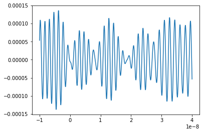

Note that since :class:`ThermalNoise` inherits from :class:`FunctionSignal`, it can be extrapolated nicely to new times. It may be highly periodic outside of its original time range however, unless a larger number of frequencies is requested on initialization. ::

    short_noise = pyrex.ThermalNoise(times=time_array, temperature=noise_temp,
                                     resistance=system_resistance,
                                     f_band=(100e6, 400e6))
    long_noise = short_noise.with_times(np.linspace(-10e-9, 90e-9, 2001))

    plt.plot(short_noise.times, short_noise.values)
    plt.show()
    plt.plot(long_noise.times, long_noise.values)
    plt.show()

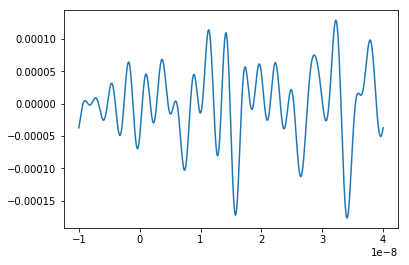
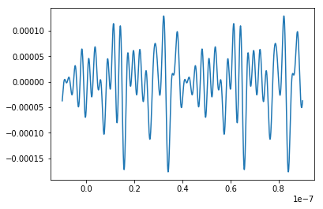

Antenna Class and Subclasses
============================

The base :class:`Antenna` class provided by PyREx is designed to be subclassed in order to match the needs of each project. At its core, an :class:`Antenna` object is initialized with a position, a temperature, and a frequency range, as well as optionally a resistance (for noise calculations) and a boolean dictating whether or not noise should be added to the antenna's signals (note that if noise is to be added, a resistance must be specified). ::

    # Please note that some values are unrealistic for demonstration purposes
    position = (0, 0, -100) # m
    temperature = 300 # K
    resistance = 1e17 # ohm
    frequency_range = (0, 5) # Hz
    basic_antenna = pyrex.Antenna(position=position, temperature=temperature,
                                  resistance=resistance,
                                  freq_range=frequency_range)
    noiseless_antenna = pyrex.Antenna(position=position, noisy=False)

The basic properties of an :class:`Antenna` object are :attr:`is_hit` and :attr:`waveforms`. The :attr:`is_hit` property specifies whether or not the antenna has been triggered by an event. :attr:`waveforms` is a list of all the waveforms which have triggered the antenna. The antenna also defines a :attr:`signals` attribute, which is a list of all signals the antenna has received, and :attr:`all_waveforms` which is a list of all waveforms (signal plus noise) the antenna has received including those which didn't trigger. ::

    basic_antenna.is_hit == False
    basic_antenna.waveforms == []

The :class:`Antenna` class contains two attributes and three methods which represent characteristics of the antenna as they relate to signal processing. The attributes are :attr:`efficiency` and :attr:`antenna_factor`, and the methods are :meth:`Antenna.response`, :meth:`Antenna.directional_gain`, and :meth:`Antenna.polarization_gain`. The attributes are to be set and the methods overwritten in order to custmoize the way the antenna responds to incoming signals. :attr:`efficiency` is simply a scalar which multiplies the signal the antenna receives (default value is ``1``). :attr:`antenna_factor` is a factor used in converting received electric fields into voltages (:attr:`antenna_factor` = E / V; default value is ``1``). :meth:`Antenna.response` takes a frequency or list of frequencies (in Hz) and returns the frequency response of the antenna at each frequency given (default always returns ``1``). :meth:`Antenna.directional_gain` takes angles theta and phi in the antenna's coordinates and returns the antenna's gain for a signal coming from that direction (default always returns ``1``). :meth:`Antenna.directional_gain` is dependent on the antenna's orientation, which is defined by its :attr:`z_axis` and :attr:`x_axis` attributes. To change the antenna's orientation, use the :meth:`Antenna.set_orientation` method which takes ``z_axis`` and ``x_axis`` arguments. Finally, :meth:`Antenna.polarization_gain` takes a polarization vector and returns the antenna's gain for a signal with that polarization (default always returns ``1``). ::

    basic_antenna.efficiency == 1
    basic_antenna.antenna_factor == 1
    freqs = [1, 2, 3, 4, 5]
    basic_antenna.response(freqs) == [1, 1, 1, 1, 1]
    basic_antenna.directional_gain(theta=np.pi/2, phi=0) == 1
    basic_antenna.polarization_gain([0,0,1]) == 1

The :class:`Antenna` class defines an :meth:`Antenna.trigger` method which is also expected to be overwritten. :meth:`Antenna.trigger` takes a :class:`Signal` object as an argument and returns a boolean of whether or not the antenna would trigger on that signal (default always returns ``True``). ::

    basic_antenna.trigger(pyrex.Signal([0],[0])) == True

The :class:`Antenna` class also defines an :meth:`Antenna.receive` method which takes a :class:`Signal` object and processes the signal according to the antenna's attributes (:attr:`efficiency`, :attr:`antenna_factor`, :attr:`response`, :attr:`directional_gain`, and :attr:`polarization_gain` as described above). To use the :meth:`Antenna.receive` method, simply pass it the :class:`Signal` object the antenna sees, and the :class:`Antenna` class will handle the rest. You can also optionally specify the direction of travel of the signal (used in the :meth:`Antenna.directional_gain` calculation) and the polarization direction of the signal (used in the :meth:`Antenna.polarization_gain` calculation). If either of these is unspecified, the corresponding gain will simply be set to ``1``. ::

    incoming_signal_1 = pyrex.FunctionSignal(np.linspace(0,2*np.pi), np.sin,
                                             value_type=pyrex.Signal.Type.voltage)
    incoming_signal_2 = pyrex.FunctionSignal(np.linspace(4*np.pi,6*np.pi), np.sin,
                                             value_type=pyrex.Signal.Type.voltage)
    basic_antenna.receive(incoming_signal_1)
    basic_antenna.receive(incoming_signal_2, direction=[0,0,1], polarization=[1,0,0])
    basic_antenna.is_hit == True
    for waveform, pure_signal in zip(basic_antenna.waveforms, basic_antenna.signals):
        plt.figure()
        plt.plot(waveform.times, waveform.values, label="Waveform")
        plt.plot(pure_signal.times, pure_signal.values, label="Pure Signal")
        plt.legend()
        plt.show()

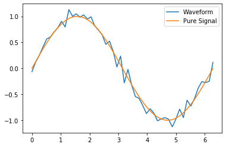
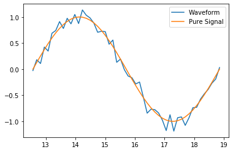

Beyond :attr:`Antenna.waveforms`, the :class:`Antenna` object also provides methods for checking the waveform and trigger status for arbitrary times: :meth:`Antenna.full_waveform` and :meth:`Antenna.is_hit_during`. Both of these methods take a time array as an argument and return either the waveform :class:`Signal` object for those times or whether said waveform triggered the antenna, respectively. ::

    total_waveform = basic_antenna.full_waveform(np.linspace(0,20))
    plt.plot(total_waveform.times, total_waveform.values, label="Total Waveform")
    plt.plot(incoming_signal_1.times, incoming_signal_1.values, label="Pure Signals")
    plt.plot(incoming_signal_2.times, incoming_signal_2.values, color="C1")
    plt.legend()
    plt.show()

    basic_antenna.is_hit_during(np.linspace(0, 200e-9)) == True

.. image:: _static/example_outputs/antenna_3.png

Finally, the :class:`Antenna` class defines an :meth:`Antenna.clear` method which will reset the antenna to a state of having received no signals::

    basic_antenna.clear()
    basic_antenna.is_hit == False
    len(basic_antenna.waveforms) == 0

The :meth:`Antenna.clear` method can also optionally reset the source of noise waveforms by passing ``reset_noise=True`` so that if the same signals are given after the antenna is cleared, the noise waveforms will be different::

    noise_before = basic_antenna.make_noise(np.linspace(0, 20))
    plt.plot(noise_before.times, noise_before.values, label="Noise Before Clear")
    basic_antenna.clear(reset_noise=True)
    noise_after = basic_antenna.make_noise(np.linspace(0, 20))
    plt.plot(noise_after.times, noise_after.values, label="Noise After Clear")
    plt.legend()
    plt.show()

.. image:: _static/example_outputs/antenna_4.png

To create a custom antenna, simply inherit from the :class:`Antenna` class::

    class NoiselessThresholdAntenna(pyrex.Antenna):
        def __init__(self, position, threshold):
            super().__init__(position=position, noisy=False)
            self.threshold = threshold

        def trigger(self, signal):
            if max(np.abs(signal.values)) > self.threshold:
                return True
            else:
                return False

Our custom :class:`NoiselessThresholdAntenna` should only trigger when the amplitude of a signal exceeds its threshold value::

    my_antenna = NoiselessThresholdAntenna(position=(0, 0, 0), threshold=2)

    incoming_signal = pyrex.FunctionSignal(np.linspace(0,10), np.sin,
                                           value_type=pyrex.Signal.Type.voltage)
    my_antenna.receive(incoming_signal)
    my_antenna.is_hit == False
    len(my_antenna.waveforms) == 0
    len(my_antenna.all_waveforms) == 1

    incoming_signal = pyrex.Signal(incoming_signal.times,
                                   5*incoming_signal.values,
                                   incoming_signal.value_type)
    my_antenna.receive(incoming_signal)
    my_antenna.is_hit == True
    len(my_antenna.waveforms) == 1
    len(my_antenna.all_waveforms) == 2

    for wave in my_antenna.waveforms:
        plt.figure()
        plt.plot(wave.times, wave.values)
        plt.show()

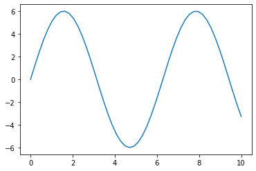

For more on customizing PyREx, see the :ref:`custom-package` section.

PyREx also defines :class:`DipoleAntenna`, a subclass of :class:`Antenna` which provides a basic threshold trigger, a basic bandpass filter frequency response, a sine-function directional gain, and a typical dot-product polarization effect. A :class:`DipoleAntenna` object can be created as follows::

    antenna_identifier = "antenna 1"
    position = (0, 0, -100)
    center_frequency = 250e6 # Hz
    bandwidth = 300e6 # Hz
    resistance = 100 # ohm
    antenna_length = 3e8/center_frequency/2 # m
    polarization_direction = (0, 0, 1)
    trigger_threshold = 1e-5 # V
    dipole = pyrex.DipoleAntenna(name=antenna_identifier,position=position,
                                 center_frequency=center_frequency,
                                 bandwidth=bandwidth, resistance=resistance,
                                 effective_height=antenna_length,
                                 orientation=polarization_direction,
                                 trigger_threshold=trigger_threshold)

AntennaSystem and Detector Classes
==================================

The :class:`AntennaSystem` class is designed to bridge the gap between the basic antenna classes and realistic antenna systems including front-end processing of the antenna's signals. It is designed to be subclassed, but by default it takes as an argument the :class:`Antenna` class or subclass it is extending, or an object of that class. It provides an interface nearly identical to that of the :class:`Antenna` class, but where an :meth:`AntennaSystem.front_end` method (which by default does nothing) is applied to the extended antenna's signals.

To extend an :class:`Antenna` class or subclass into a full antenna system, inherit from the :class:`AntennaSystem` class and define the :meth:`AntennaSystem.front_end` method. A different trigger optionally can be defined for the antenna system (by default it uses the antenna's trigger)::

    class PowerAntennaSystem(pyrex.AntennaSystem):
        """Antenna system whose signals and waveforms are powers instead of
        voltages."""
        def __init__(self, position, temperature, resistance, frequency_range):
            super().__init__(pyrex.Antenna)
            # The setup_antenna method simply passes all arguments on to the
            # antenna class passed to super.__init__() and stores the resulting
            # antenna to self.antenna
            self.setup_antenna(position=position, temperature=temperature,
                               resistance=resistance,
                               freq_range=frequency_range)

        def front_end(self, signal):
            return pyrex.Signal(signal.times, signal.values**2,
                                value_type=pyrex.Signal.Type.power)

Objects of this class can then, for the most part, be interacted with as though they were regular antenna objects::

    position = (0, 0, -100) # m
    temperature = 300 # K
    resistance = 1e17 # ohm
    frequency_range = (0, 5) # Hz

    basic_antenna_system = PowerAntennaSystem(position=position,
                                              temperature=temperature,
                                              resistance=resistance,
                                              frequency_range=frequency_range)

    basic_antenna_system.trigger(pyrex.Signal([0],[0])) == True

    incoming_signal_1 = pyrex.FunctionSignal(np.linspace(0,2*np.pi), np.sin,
                                             value_type=pyrex.Signal.Type.voltage)
    incoming_signal_2 = pyrex.FunctionSignal(np.linspace(4*np.pi,6*np.pi), np.sin,
                                             value_type=pyrex.Signal.Type.voltage)
    basic_antenna_system.receive(incoming_signal_1)
    basic_antenna_system.receive(incoming_signal_2, direction=[0,0,1],
                                 polarization=[1,0,0])
    basic_antenna_system.is_hit == True
    for waveform, pure_signal in zip(basic_antenna_system.waveforms,
                                     basic_antenna_system.signals):
        plt.figure()
        plt.plot(waveform.times, waveform.values, label="Waveform")
        plt.plot(pure_signal.times, pure_signal.values, label="Pure Signal")
        plt.legend()
        plt.show()

    total_waveform = basic_antenna_system.full_waveform(np.linspace(0,20))
    plt.plot(total_waveform.times, total_waveform.values, label="Total Waveform")
    plt.plot(incoming_signal_1.times, incoming_signal_1.values, label="Pure Signals")
    plt.plot(incoming_signal_2.times, incoming_signal_2.values, color="C1")
    plt.legend()
    plt.show()

    basic_antenna_system.is_hit_during(np.linspace(0, 200e-9)) == True

    basic_antenna_system.clear()
    basic_antenna_system.is_hit == False
    len(basic_antenna_system.waveforms) == 0

.. image:: _static/example_outputs/detector_1.png
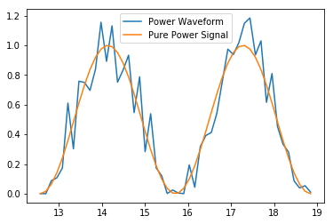
.. image:: _static/example_outputs/detector_3.png

The :class:`Detector` class is another convenience class meant to be subclassed. It is useful for automatically generating many antennas (as would be used in a detector). Subclasses must define a :meth:`Detector.set_positions` method to assign vector positions to the self.antenna_positions attribute. By default :meth:`Detector.set_positions` will raise a :exc:`NotImplementedError`. Additionally subclasses may extend the default :meth:`Detector.build_antennas` method which by default simply builds antennas of a passed antenna class using any keyword arguments passed to the method. In addition to simply generating many antennas at desired positions, another convenience of the :class:`Detector` class is that once the :meth:`Detector.build_antennas` method is run, it can be iterated directly as though the object were a list of the antennas it generated. An example of subclassing the :class:`Detector` class is shown below::

    class AntennaGrid(pyrex.Detector):
        """A detector composed of a plane of antennas in a rectangular grid layout
        some distance below the ice."""
        def set_positions(self, number, separation=10, depth=-50):
            self.antenna_positions = []
            n_x = int(np.sqrt(number))
            n_y = int(number/n_x)
            dx = separation
            dy = separation
            for i in range(n_x):
                x = -dx*n_x/2 + dx/2 + dx*i
                for j in range(n_y):
                    y = -dy*n_y/2 + dy/2 + dy*j
                    self.antenna_positions.append((x, y, depth))

    grid_detector = AntennaGrid(9)

    # Build the antennas
    temperature = 300 # K
    resistance = 1e17 # ohm
    frequency_range = (0, 5) # Hz
    grid_detector.build_antennas(pyrex.Antenna, temperature=temperature,
                                 resistance=resistance,
                                 freq_range=frequency_range)

    plt.figure(figsize=(6,6))
    for antenna in grid_detector:
        x = antenna.position[0]
        y = antenna.position[1]
        plt.plot(x, y, "kD")
    plt.ylim(plt.xlim())
    plt.show()

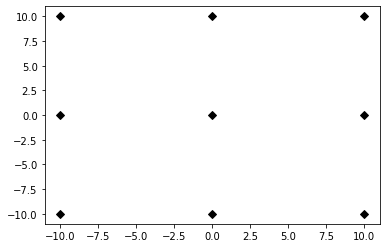

Due to the parallels between :class:`Antenna` and :class:`AntennaSystem`, an antenna system may also be used in the custom detector class. Note however, that the antenna positions must be accessed as :attr:`antenna.antenna.position` since we didn't define a position attribute for the :class:`PowerAntennaSystem`::

    grid_detector = AntennaGrid(12)

    # Build the antennas
    temperature = 300 # K
    resistance = 1e17 # ohm
    frequency_range = (0, 5) # Hz
    grid_detector.build_antennas(PowerAntennaSystem, temperature=temperature,
                                resistance=resistance,
                                frequency_range=frequency_range)

    for antenna in grid_detector:
        x = antenna.antenna.position[0]
        y = antenna.antenna.position[1]
        plt.plot(x, y, "kD")
    plt.show()

.. image:: _static/example_outputs/detector_5.png

Ice and Earth Models
====================

PyREx provides a class :class:`IceModel`, which is an alias for whichever south pole ice model class is preferred (currently :class:`pyrex.ice_model.AntarcticIce`). The :class:`IceModel` class provides class methods for calculating characteristics of the ice at different depths and frequencies outlined below::

    depth = -1000 # m
    pyrex.IceModel.temperature(depth)
    pyrex.IceModel.index(depth)
    pyrex.IceModel.gradient(depth)
    frequency = 1e8 # Hz
    pyrex.IceModel.attenuation_length(depth, frequency)

PyREx also provides two functions realted to its earth model: :func:`prem_density` and :func:`slant_depth`. :func:`prem_density` calculates the density in grams per cubic centimeter of the earth at a given radius::

    radius = 6360000 # m
    pyrex.prem_density(radius)

:func:`slant_depth` calculates the material thickness in grams per square centimeter of a chord cutting through the earth at a given nadir angle, starting from a given depth::

    nadir_angle = 60 * np.pi/180 # radians
    depth = 1000 # m
    pyrex.slant_depth(nadir_angle, depth)

Ray Tracing
===========

PyREx provides ray tracing in the :class:`RayTracer` and :class:`RayTracePath` classes. :class:`RayTracer` takes a launch point and receiving point as arguments (and optionally an ice model and z-step), and will solve for the paths between the points (as :class:`RayTracePath` objects). ::

    start = (0, 0, -250) # m
    finish = (100, 0, -100) # m
    my_ray_tracer = pyrex.RayTracer(from_point=start, to_point=finish)

The two most useful properties of :class:`RayTracer` are :attr:`exists` and :attr:`solutions`. The :attr:`exists` property is a boolean value of whether or not path solutions exist between the launch and receiving points. :attr:`solutions` is the list of (zero or two) :class:`RayTracePath` objects which exist between the launch and receiving points. There are many other properties available in :class:`RayTracer`, outlined in the :ref:`pyrex-api` section, which are mostly used internally and maybe not interesting otherwise. ::

    my_ray_tracer.exists
    my_ray_tracer.solutions

The :class:`RayTracePath` class contains the attributes of the paths between points. The most useful properties of :class:`RayTracePath` are :attr:`tof`, :attr:`path_length`, :attr:`emitted_direction`, and :attr:`received_direction`. These properties provide the time of flight, path length, and direction of rays at the launch and receiving points respectively. ::

    my_path = my_ray_tracer.solutions[0]
    my_path.tof
    my_path.path_length
    my_path.emitted_direction
    my_path.received_direction

:class:`RayTracePath` also provides a :meth:`RayTracePath.attenuation` method which gives the attenuation of the signal at a given frequency (or frequencies), and a :attr:`RayTracePath.coordinates` property which gives the x, y, and z coordinates of the path (useful mostly for plotting, and are not guaranteed to be accurate for other purposes). ::

    frequency = 500e6 # Hz
    my_path.attenuation(100e6)
    my_path.attenuation(np.linspace(1e8, 1e9, 11))
    plt.plot(my_path.coordinates[0], my_path.coordinates[2])
    plt.show()

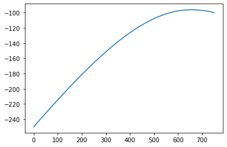

Finally, :meth:`RayTracePath.propagate` propagates a :class:`Signal` object from the launch point to the receiving point of the path by applying the frequency-dependent attenuation from :meth:`RayTracePath.attenuation`, and shifting the signal times by :attr:`RayTracePath.tof`. Note that it does not apply a 1/R effect based on the path length. If needed, this effect should be added in manually. ::

    time_array = np.linspace(0, 5e-9, 1001)
    my_signal = (pyrex.FunctionSignal(time_array, lambda t: np.sin(1e9*2*np.pi*t))
                + pyrex.FunctionSignal(time_array, lambda t: np.sin(1e10*2*np.pi*t)))
    plt.plot(my_signal.times, my_signal.values)
    plt.show()

    my_path.propagate(my_signal)
    plt.plot(my_signal.times, my_signal.values)
    plt.show()

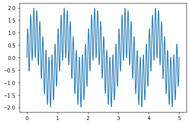
.. image:: _static/example_outputs/ray_tracing_3.png

.. _particle-generation:

Particle Generation
===================

PyREx includes the :class:`Particle` class as a container for information about neutrinos which are generated to produce Askaryan pulses. A :class:`Particle` contains an :attr:`id`, a :attr:`vertex`, a :attr:`direction`, an :attr:`energy`, an :attr:`interaction`, and a :attr:`weight`::

    particle_type = pyrex.Particle.Type.electron_neutrino
    initial_position = (0,0,0) # m
    direction_vector = (0,0,-1)
    particle_energy = 1e8 # GeV
    particle = pyrex.Particle(particle_id=particle_type, vertex=initial_position,
                              direction=direction_vector, energy=particle_energy)

The :attr:`interaction` attribute is an instance of an :class:`Interaction` class (:class:`NeutrinoInteraction` by default) which is a model for how the neutrino interacts in the ice. It has a :attr:`kind` denoting whether the interaction will be charged-current or neutral-current, an :attr:`inelasticity`, :attr:`em_frac` and :attr:`had_frac` describing the resulting particle shower(s), and :attr:`cross_section` and :attr:`interaction_length` in the ice at the energy of the parent :class:`Particle` object::

    type(particle.interaction)
    particle.interaction.kind
    particle.interaction.inelasticity
    particle.interaction.em_frac
    particle.interaction.had_frac
    particle.interaction.cross_section
    particle.interaction.interaction_length

PyREx also includes a :class:`ShadowGenerator` class for generating random neutrinos, taking into account Earth shadowing. The neutrinos are generated in a box of given size, and with a given energy (which can be a scalar value or a function returning scalar values). A desired flavor ratio can also be given::

    box_width = 1000 # m
    box_depth = 500 # m
    flavor_ratio = (1, 1, 1) # even distribution of neutrino flavors
    my_generator = pyrex.ShadowGenerator(dx=box_width, dy=box_width,
                                         dz=box_depth,
                                         energy=particle_energy,
                                         flavor_ratio=flavor_ratio)
    my_generator.create_event()

The :meth:`ShadowGenerator.create_event` method returns an :class:`Event` object, which contains a tree of :class:`Particle` objects representing the event. Currently this tree will only contain a single neutrino, but could be expanded in the future in order to describe more exotic events. The neutrino is available as the only element in the list :attr:`Event.roots`. It could also be accessed by iterating the :class:`Event` object.

Lastly, PyREx includes :class:`ListGenerator` and :class:`FileGenerator` classes which can be used to reproduce pre-generated events from either a list or from numpy files, respectively. For example, to continuously re-throw our :class:`Particle` object from above::

    repetitive_generator = pyrex.ListGenerator([pyrex.Event(particle)])
    repetitive_generator.create_event()
    repetitive_generator.create_event()

Full Simulation
===============

PyREx provides the :class:`EventKernel` class to control a basic simulation including the creation of neutrinos and their respective signals, the propagation of their pulses to the antennas, and the triggering of the antennas. The :class:`EventKernel` is designed to be modular and can use a specific ice model, ray tracer, and signal times as specified in optional arguments (the defaults are explicitly specified below)::

    particle_generator = pyrex.ShadowGenerator(dx=1000, dy=1000, dz=500,
                                               energy=1e8)
    detector = []
    for i, z in enumerate([-100, -150, -200, -250]):
        detector.append(
            pyrex.DipoleAntenna(name="antenna_"+str(i), position=(0, 0, z),
                                center_frequency=250e6, bandwidth=300e6,
                                resistance=0, effective_height=0.6,
                                trigger_threshold=1e-4, noisy=False)
        )
    kernel = pyrex.EventKernel(generator=particle_generator,
                               antennas=detector,
                               ice_model=pyrex.IceModel,
                               ray_tracer=pyrex.RayTracer,
                               signal_times=np.linspace(-20e-9, 80e-9, 2000,
                                                        endpoint=False))

    triggered = False
    while not triggered:
        event = kernel.event()
        for antenna in detector:
            if antenna.is_hit:
                triggered = True
                break

    particle = event.roots[0]
    print("Particle type:   ", particle.id)
    print("Shower vertex:   ", particle.vertex)
    print("Shower axis:     ", particle.direction)
    print("Particle energy: ", particle.energy)
    print("Interaction type:", particle.interaction.kind)
    print("Electromagnetic shower fraction:", particle.interaction.em_frac)
    print("Hadronic shower fraction:       ", particle.interaction.had_frac)
    print("Event weight:", particle.weight)

    for antenna in detector:
        for i, wave in enumerate(antenna.waveforms):
            plt.plot(wave.times * 1e9, wave.values)
            plt.xlabel("Time (ns)")
            plt.ylabel("Voltage (V)")
            plt.title(antenna.name + " - waveform "+str(i))

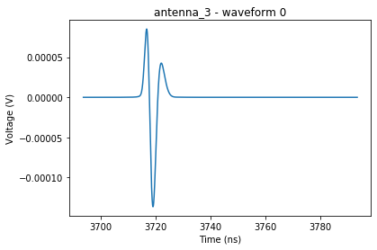
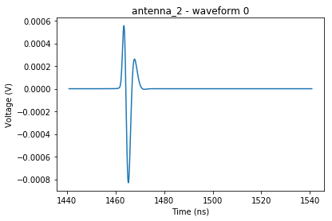

More Examples
=============

For more code examples, see the :ref:`example-code` section and the python notebooks in the examples directory.
